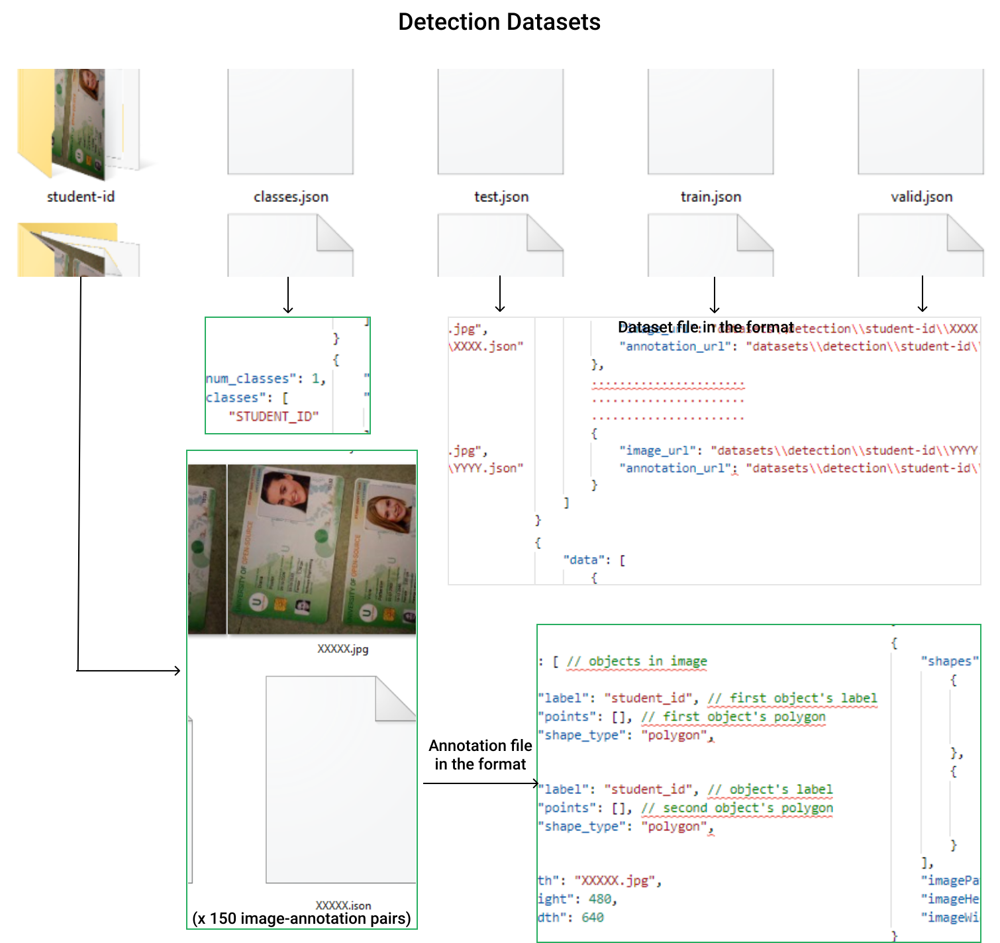
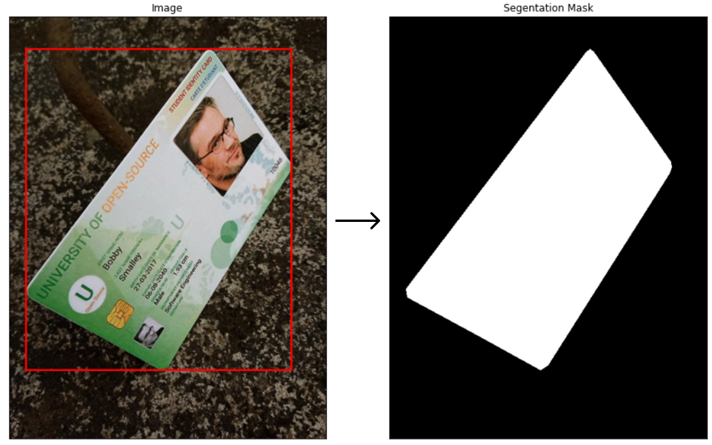
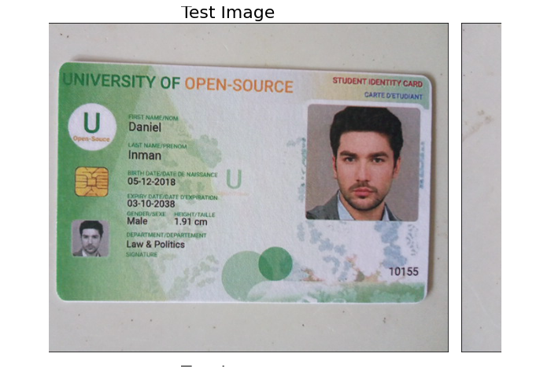
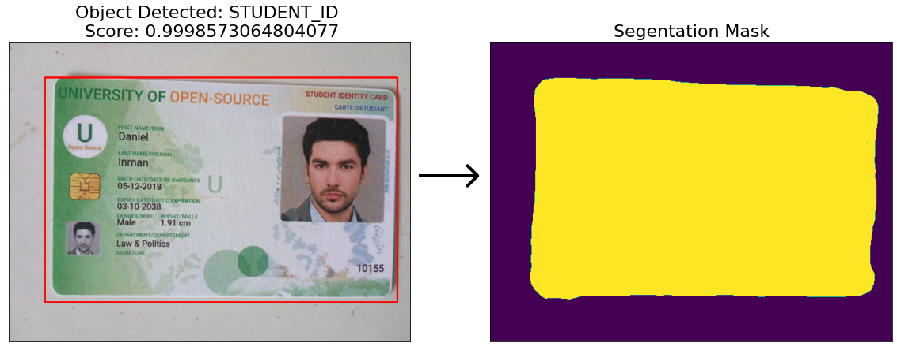

import useBaseUrl from '@docusaurus/useBaseUrl';
import CodeBlock from "../src/utils/CodeBlock"
import OutputBlock from "../src/utils/OutputBlock"

To locate student-id(s) within images, we gonna leverage transfer learning via fine-tuning the state of art object segmentation algorithm [**Mask R-CNN**](https://arxiv.org/abs/1703.06870)  backboned by pre-trained [**ResNet-50**](https://pytorch.org/docs/stable/torchvision/models.html#mask-r-cnn) available in torchvision models gallery.

So, let's resolve the imports of our detection module.
<CodeBlock lines={[5,6,17,19]} file="detection_module_imports"></CodeBlock>

Code Brieffing

*   Import [torch](https://pytorch.org/docs/stable/torch.html) and [torchvision](https://pytorch.org/docs/stable/torchvision/) which are libraries of the Pytorch project.
*   [torchvision.transforms.ToTensor()](https://pytorch.org/docs/stable/torchvision/transforms.html?highlight=torchvision%20transforms%20totensor#torchvision.transforms.ToTensor) reurns a function which takes in a PIL image and converts it to a [tensor](https://pytorch.org/docs/stable/generated/torch.tensor.html?highlight=tensor#torch.tensor).
*   [torchvision.transforms.ToPILImage()](https://pytorch.org/docs/stable/torchvision/transforms.html?highlight=torchvision%20transforms%20topilimage#torchvision.transforms.ToPILImage) reurns a function which that does the opposite.

## **1.1. Detection Dataset**
### 1.1.1. Define dataset class
A crucial requirement when fine-tuning, training, or inferencing models in Pytorch is to know the exact formats of data that specific models expect as inputs and compute as outputs.

The input to the model is expected to be a list of tensors, each of shape ``[C, H, W]``, one for each image, and should be in the range``0-1`` . Different images can have different sizes.

**Let's take a look at the format of targets expected by the model**.
*   boxes (``FloatTensor[N, 4]``): the ground-truth boxes in ``[x1, y1, x2, y2]`` format, with values of ``x`` between ``0`` and ``W`` and values of y between ``0`` and ``H``.
*   labels (``Int64Tensor[N]``): the class label for each ground-truth box.
*   masks (``UInt8Tensor[N, H, W]``): the segmentation binary masks for each instance.

**Then, we shall also take a look at the format of outputs predicted by the model**.
*   boxes (``FloatTensor[N, 4]``): the predicted boxes in ``[x1, y1, x2, y2]`` format, with values of ``x`` between ``0`` and ``W`` and values of ``y`` between ``0`` and ``H``.
*   labels (``Int64Tensor[N]``): the predicted labels for each image.
*   scores (``Tensor[N]``): the scores or each prediction.
*   masks (``UInt8Tensor[N, 1, H, W]``): the predicted masks for each instance, in the range ``0-1``. To obtain the final segmentation masks, the soft masks can be thresholded, generally with a value of ``0.5`` (``mask >= 0.5``).

Recall from the [project description](/introduction/#project-description/) that we shall train our detection model on the [**Student-ID**](https://github.com/MbassiJaphet/pytorch-for-information-extraction/tree/master/code/datasets/detection) dataset. So let’s examine its format !

Now, knowing the formats of the Student-ID dataset as well as the formats of inputs/targets/outputs of the pre-trained model, we can confidently code a custom dataset class inheriting from [torch.utils.data.Dataset](https://pytorch.org/docs/stable/data.html#torch.utils.data.Dataset).
<CodeBlock lines={[7,49,50,51,53,58,59,60,61,62,63,67]} file="detection_dataset"></CodeBlock>

Code Brieffing

*   We defined the ``DetectionDataset`` class initialized with ``data_path``(folder containing detection dataset), a ``mode``(**'TRAIN'**, **'VALID'**, **'TEST'**), and ``transform`` (data augmentation function).
*   We implicitly assigned anything but our ``classes`` to the **'BACKGROUND'** class.
*   We implemented [``__getitem__``](https://pytorch.org/docs/stable/data.html?highlight=torch%20utils%20data%20dataset#torch.utils.data.Dataset) to return individual elements of our dataset as (``image_tensor``, ``targets``) pairs.
*   [torch.from_numpy()](https://pytorch.org/docs/stable/generated/torch.from_numpy.html?highlight=torch%20from_numpy#torch.from_numpy) Creates a Tensor from a numpy.ndarray
*   [torch.as_tensor()](https://pytorch.org/docs/stable/generated/torch.as_tensor.html?highlight=torch%20as_tensor#torch.as_tensor) Convert the data into a torch.Tensor

### 1.1.2. Define transforms for detection dataset
Let's write some helper functions for data augmentation.
<CodeBlock file="detection_dataset_transforms"></CodeBlock>

### 1.1.3. Instantiate detection datasets
<CodeBlock lines={[3,5,7]} file="detection_dataset_init"></CodeBlock>

Code Brieffings

*   We initialized **training**, **validation**, and **testing** datasets using the modes 'TRAIN', 'VALID' and 'TEST' respectively.
*   We **disabled** data augmentation for testing dataset.
*   We initialized the variables``detection_classes``, and ``num_detection_classes`` to values of our **detection classes** and their **number** respectively.

Just checking the names and number of classes from our detection dataset to make sure everything is **OK**!
<CodeBlock file="detection_dataset_classes"></CodeBlock>
<OutputBlock file="detection_dataset_classes_output"></OutputBlock>

### 1.1.4. Visualize detection dataset
<CodeBlock lines={[6,8,9,20,21,24,25,29]} file="detection_dataset_visualize"></CodeBlock>

Code Brieffings

*   We selected an inidividual element from ``detection_train_set`` using ``id`` as (``image_tensor``, ``targets``) pairs.
*   We retrieved bounding boxes, segmentation masks, and labels from the ``targets`` dictionary.
*   [torch.zeros_like()](https://pytorch.org/docs/stable/generated/torch.zeros_like.html?highlight=torch%20zeros_like#torch.zeros_like) returns a tensor filled ``0s``, with the same size as input.
*   [torch.Tensor.item()](https://pytorch.org/docs/stable/tensors.html?highlight=tensor%20item#torch.Tensor.item) returns the value of this tensor as a standard Python number.

## **1.2. Detection Model**
### 1.2.1. Define detection model
Let's define a helper function to instantiate the detection model !
<CodeBlock lines={[1,2,6,8,11,13,16,17]} file="detection_model_init_function"></CodeBlock>

Code Brieffings

*   We imported [Mask-RCNN predictor](https://pytorch.org/docs/stable/torchvision/models.html?highlight=torchvision%20models%20detection%20faster_rcnn#mask-r-cnn) and [Fast-RCNN predictor](https://pytorch.org/docs/stable/torchvision/models.html?highlight=torchvision%20models%20detection%20faster_rcnn#faster-r-cnn) heads.
*   Loaded **Mask R-CNN model** with pre-trained **ResNet-50-FPN** backbone and **finetuned** it using ``num_classes``. Using the pre-trained model implicitly makes us use [**transfer learning**](https://en.wikipedia.org/wiki/Transfer_learning) which in turn makes our model converge faster.
*   Used [detection_model.load_state_dict()](https://pytorch.org/docs/stable/generated/torch.nn.Module.html?highlight=load_state_dict#torch.nn.Module.load_state_dict) to set model weights from state dictionary if ``state_dict`` is given.

>**Remark:** The helper function above allows us to fine-tune the pre-trained **FastRCNNPredictor** and **MaskRCNNPredictor** with the desired number of classes, which are **'2'** in our case i.e. for the 'BACKGROUND' and 'Student_ID' classes. The function also sets the number of hidden layers of **MaskRCNNPredictor** to **'256'** but we can decide to tweak that for the best of our model performance.

### 1.2.2. Specify checkpoints and instantiate the model 
Looking forward to **resumable** training and saving of our detection model, we shall now specify the checkpoints for the **state dictionaries** for both the model and its training optimizer.
<CodeBlock lines={[2,14,22]} file="detection_checkpoint"></CodeBlock>

Code Brieffings

*   Selected available computational hardware using [torch.device()](https://pytorch.org/docs/stable/tensor_attributes.html?highlight=torch%20device#torch.torch.device).
*   [torch.cuda.is_available()](https://pytorch.org/docs/stable/cuda.html?highlight=torch%20cuda%20is_available#torch.cuda.is_available) returns ``True`` if cuda capable hardware(s) is/are found.
*   Loaded checkpoints using [torch.load()](https://pytorch.org/docs/stable/generated/torch.load.html?highlight=torch%20load#torch.load). The argument ``map_location`` is used to specify the computing device into which the checkpoint is loaded. This very useful if you have no idea of the device type for which a tensor has been saved.

<OutputBlock file="detection_checkpoint_output"></OutputBlock>

## **1.3. Training and Evaluation**
**Note** that the files used for training and validation of detection module found ``./modules/detection/scripts`` folder were directly copied along with their dependencies from torchvision reference detection training scripts repository.

### 1.3.1. Specify data loaders
After initializing the various detection datasets, let us use them to specify data loaders which shall be used for training, validation, and testing.
<CodeBlock lines={[4,9,14,19]} file="detection_dataset_loaders"></CodeBlock>

Code Brieffings

*   Initialized data loaders for each of our detection datasets (training, validation and testing) by using [torch.utils.data.DataLoader()](https://pytorch.org/docs/stable/data.html?highlight=torch%20utils%20data%20dataloader#torch.utils.data.DataLoader).
*   Initialized the dictionary variable '``detection_loaders ``', which references all of the data loaders.

### 1.3.2. Initialize optimizer
Let's initialize the optimizer for training the detection model, and get ready for training !
<CodeBlock lines={[2,4,,6,11]} file="detection_optimizer_init"></CodeBlock>
<OutputBlock file="detection_optimizer_init_output"></OutputBlock>

### 1.3.3. Define training function
Now, let's write the function that will train and validate our model for us. Inside the training function, we shall add a few lines of code that will save our model checkpoints.
<CodeBlock lines={[12,18,20,22]} file="detection_model_train_function"></CodeBlock>

### 1.3.4 Train detection model
So let’s train our detection model for 20 epochs saving it at the end of each epoch.
<CodeBlock file="detection_model_train"></CodeBlock>
<OutputBlock file="detection_model_train_output"></OutputBlock>

### 1.3.5. Resume training detection model
At the end of every epoch, we had the checkpoints of the detection module updated. Now let's use these updated checkpoints to reload the detection model and resume its training up to **'30'** epochs.

:::important
To reload the detection model and the detection optimizer from the checkpoint, simply re-run the code cells in Section 1.2.2. and Section 1.3.2 respectively. Just make sure ``load_detection_checkpoint`` is set to ``True``. The resulting outputs shall be identical to the ones below.
:::

Reloading detection model from the checkpoint. (Section 1.2.2)
<CodeBlock lines={[2,4,14,22]} file="detection_checkpoint"></CodeBlock>

Code Brieffings

*   Loaded checkpoint using [torch.load()](https://pytorch.org/docs/stable/generated/torch.load.html?highlight=torch%20load#torch.load). The argument ``map_location`` is used to specify the computing device into which the checkpoint is loaded.

<OutputBlock file="detection_model_init_checkpoint_output"></OutputBlock>

Reloading detection optimizer from the checkpoint (Section 1.3.2)
<CodeBlock lines={[2,4,,6,11]} file="detection_optimizer_init"></CodeBlock>

Code Brieffings

*   Used [detection_optimizer.load_state_dict()](https://pytorch.org/docs/stable/generated/torch.nn.Module.html?highlight=load_state_dict#torch.nn.Module.load_state_dict) to initialize optimizer weights if ``detection_optimizer_state_dict`` is available. This sets the optimizer to  the state after that of the previous training.

<OutputBlock file="detection_optimizer_init_checkpoint_output"></OutputBlock>

Now let's resume training of our detection model.
<CodeBlock file="detection_model_train_resume"></CodeBlock>
<OutputBlock file="detection_model_train_resume_output"></OutputBlock>

You notice that the training start from epoch **21** since the detection model has already been trained for 20 epochs.

### 1.3.6. Evaluate the detection model
To conclude on the performance of your models, it is always of good practice to evaluate them on sample data. We shall evaluate the performance of the detection model on sample images from the testing dataset.

Firstly, let's use our detection model to compute predictions for an input image from the test detection dataset.
<CodeBlock lines={[3,4,12,13,15]} file="detection_model_predict"></CodeBlock>

Code Brieffings

*   Selected an image URL from the testing dataset for inference.
*   Then put the model to evaluation mode using [detection_model.eval()](https://pytorch.org/docs/stable/generated/torch.nn.Module.html?highlight=torch%20nn%20module%20eval#torch.nn.Module.eval). That disables training features like batch normalization and dropout making inference faster.
*   Disabled gradient calculations for operations on tensors **within a block** using [``with torch.no_grad():``](https://pytorch.org/docs/stable/generated/torch.no_grad.html?highlight=torch%20no_grad#torch.no_grad).

Secondly, let's take a look at the raw outputs predicted by our detection model for the image above.
<CodeBlock file="detection_model_predictions_raw"></CodeBlock>
<OutputBlock file="detection_model_predictions_raw_output"></OutputBlock>

As we can see the predictions are simply a dictionary containing **labels**, **scores**, **boxes**, and **masks** of detected objects in tensor format.

Lastly, let's convert the raw predicted outputs into a human-understandable format for proper visualization.
<CodeBlock lines={[6,7,12,13,14,17,21]} file="detection_model_predictions_visualize"></CodeBlock>

## **1.4. Student ID Alignment**
At this point, what is left to be done in this module is to align student-id(s) detected by out detection model. The aligned student-id(s) shall then be fed as input to the orientation module.
<CodeBlock lines={[2]} file="detection_module_image_alignment"></CodeBlock>

