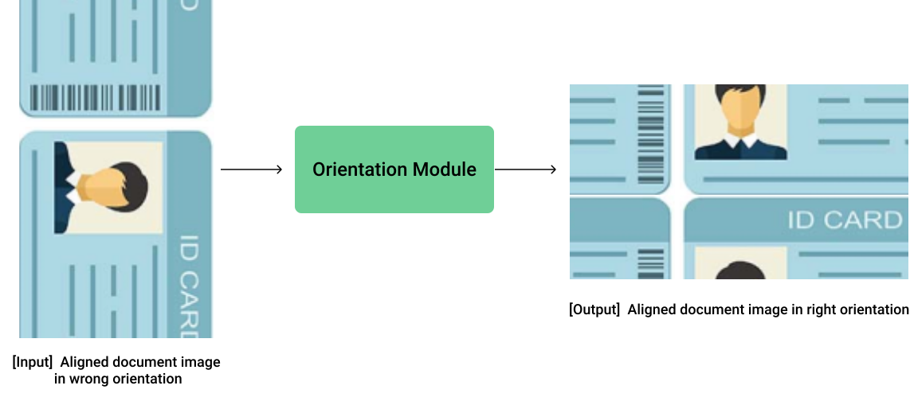

## Introduction
Welcome to this tutorial entitled **' Pytorch for Information Extraction on Image Documents '**. This tutorial aims to teach its audience how to leverage Pytorch and its most basic features to address the complex task of Information Extraction on **structured image documents**.

So, what are **structured image documents**? We define a ' structured image document ' as a digital image containing a structured document(s). Moreover, we define ' structured documents ' as documents like IDs, bills, cheques, passports, driving license, etc on which every piece of information inscribed on them has a predetermined position or field within the document.

## What will we build?
We shall build an information extraction system for student-id cards **from scratch**. In other words, at the end of this tutorial, we shall build a system that takes as input an image containing a student-id(s), and extracts from it some relevant content (i.e. first-name, birthdate, department, etc) as outputs.

Throughout the development of the information extraction system mentioned above, we will go through the fundamentals for training/testing/validation of object detection, instance segmentation, as well as image classification models using Pytorch and our Student-ID [datasets](https://github.com/MbassiJaphet/pytorch-for-information-extraction/tree/master/code/datasets).

Below are sample images of student-ids from our [Student-ID detection dataset](https://github.com/MbassiJaphet/pytorch-for-information-extraction/tree/master/code/datasets/detection).

## Proposed Methodology
As an attempt to effectively build its information extraction system, this tutorial proposes a methodology lying on top of three modules within which Pytorch and machine learning play crucial roles:

1.   A [**Detection Module**](/detection-module/), responsible for detecting and locating student-ids within images while performing [**image alignment**](https://www.learnopencv.com/image-alignment-feature-based-using-opencv-c-python/) on them.

2.   An [**Orientation Module**](/orientation-module/), next to the detection module determines the orientation of an **aligned student-id**, while rectifying it when necessary by applying the proper transformations.

3.   An [**Extraction Module**](/extraction-module/), last in the pipeline/process, extracts relevant contents from information fields of **aligned student-ids in the correct orientation**.

## Prerequisites
This tutorial assumes the reader's friendliness with Python and maybe a small machine learning background. Prior knowledge of Pytorch is not an absolute prerequisite, though having some basic knowledge of the machine learning library will help the reader to rapidly catch-on to the Pytorch related content and move along faster. So, for our Pytorch beginners' audience, there is no need to worry about not being able to follow the tutorial since the project being used as a foundation for the Pytorch educative materials is built from scratch. So just be patient, take your time, and do not rush.

**Remark**: The [datasets](https://github.com/MbassiJaphet/pytorch-for-information-extraction/tree/master/code/datasets), the [project's source code](https://github.com/MbassiJaphet/pytorch-for-information-extraction/tree/master/code), as well as this [tutorial's source code](https://github.com/MbassiJaphet/pytorch-for-information-extraction/tree/master/tutorial) are publicly available in the [project repository](https://github.com/MbassiJaphet/pytorch-for-information-extraction) on Github.

To get the most out of this tutorial you are invited to enjoy it alongside its [colab version](https://colab.research.google.com/github/MbassiJaphet/pytorch-for-information-extraction/code/tutorial.ipynb).

## Project Dependencies
Looking forward to experimenting with this tutorial in your local **Python** environment, you may have to resolve the following dependencies:
*   [pytorch](https://pytorch.org/)
*   [opencv](https://docs.opencv.org/master/)
*   [cython](https://cython.org/)
*   pycocotools

:::important

For Windows users, get ``pycocotools`` from [philferriere](https://github.com/philferriere/cocoapi) by typing the command:

``pip install "git+https://github.com/philferriere/cocoapi.git#egg=pycocotools&subdirectory=PythonAPI"``

:::