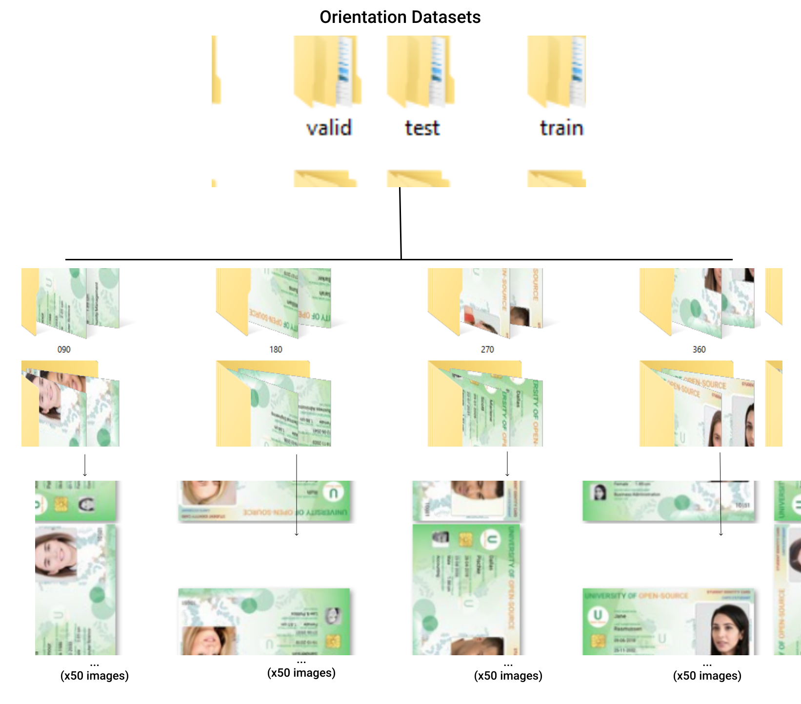

import CodeBlock from "../src/utils/CodeBlock"
import OutputBlock from "../src/utils/OutputBlock"

To predict the orientation of an aligned student-id image inputted from the detection module, we shall quickly develop an image classification model and train it on our [orientation dataset](https://github.com/MbassiJaphet/pytorch-for-information-extraction/tree/master/code/datasets/orientation). We expect the trained orientation model to predict the confidence scores for orientation angles (90, 180, 270, and 360) for an input image.

So, let's resolve the imports of our orientation module.
<CodeBlock file="orientation_module_imports"></CodeBlock>

## **2.1. Orientation Dataset**
The orientation datasets consist of folders containing four subfolders, whereby each subfolder is named according to one of the four orientation classes i.e. **'090'**, **'180'**, **'270'**, and **'360'**. Each subfolder contains images rotated according to their folder's name.

Pytorch provides [torchvision.datasets.ImageFolder](https://pytorch.org/docs/stable/torchvision/datasets.html#torchvision.datasets.ImageFolder) for loading datasets with such format without requiring us to hardcode a custom dataset class for the data like we did for the detection dataset.

### 2.1.1. Define transforms for orientation datasets
Before instantiating our various orientation datasets, we have to define the various transforms which shall be used to initialize them.
<CodeBlock file="orientation_dataset_transforms"></CodeBlock>

### 2.1.2.  Instantiate orientation datasets
We shall leverage Pytorch inbuilt torchvision.datasets.ImageFolder class to effortlessly instantiate our orientation training, validation, and testing datasets.
<CodeBlock file="orientation_dataset_init"></CodeBlock>

Just checking the names and number of classes from our orientation dataset to make sure everything is **OK**!
<CodeBlock file="orientation_dataset_classes"></CodeBlock>
<OutputBlock file="orientation_dataset_classes_output"></OutputBlock>

### 2.1.3. Visualize orientation dataset
<CodeBlock file="orientation_dataset_visualize"></CodeBlock>

## **2.2. Orientation Model**
### 2.2.1. Define Orientation Model
**Note** that the model architecture defined below expects input image tensors of shape  **(3 x 224 x 224)** taking after transforms of the orientation datasets.
Let's define an architecture for our orientation model from scratch.
<CodeBlock file="orientation_model"></CodeBlock>

Now that we have defined the architecture of our orientation model, let's define the helper function to instantiate it !
<CodeBlock file="orientation_model_init_function"></CodeBlock>

### 2.2.2. Specify checkpoint and instantiate model
Looking forward to **resumable** training and saving of our orientation model, we shall now specify the checkpoints for the **state dictionaries** of the model and its training optimizer while initializing the model at once.
<CodeBlock file="orientation_checkpoint"></CodeBlock>
<OutputBlock file="orientation_checkpoint_output"></OutputBlock>

Let's print our orientation model to check if it has been initialized as we expect.
<CodeBlock file="orientation_model_visualize"></CodeBlock>
<OutputBlock file="orientation_model_visualize_output"></OutputBlock>

## **2.3. Training and Evaluation**
### 2.3.1. Specify data loaders
After initializing the various orientation datasets, let us use them to specify data loaders which shall be used for training, validation, and testing.
<CodeBlock file="orientation_dataset_loaders"></CodeBlock>

### 2.3.2. Define loss function and optimizer
Let's initialize the optimizer for training the orientation model, and get ready for training !
<CodeBlock file="orientation_optimizer"></CodeBlock>

### 2.3.3. Define training function
<CodeBlock file="orientation_model_train_function"></CodeBlock>

### 2.3.4. Train orientation model
Now let's train our orientation model for 20 epochs.
<CodeBlock file="orientation_model_train"></CodeBlock>
<OutputBlock file="orientation_model_train_output"></OutputBlock>

### 2.3.5. Resume training orientation model
At the end of every epoch, we had the checkpoints of the orientation module updated. Now let's use these updated checkpoints to reload the orientation model with orientation optimizer and resume the training up to **'30'** epochs.

:::important

To reload the orientation model and the orientation optimizer from the checkpoint, simply re-run the code cells in Section 2.2.2. and Section 2.3.2 respectively. Just make sure ``load_orientation_checkpoint`` is set to ``True``. The resulting outputs shall be identical to the ones below.

:::

Reloading orientation model from the checkpoint. (Section 2.2.2)
<CodeBlock file="orientation_checkpoint"></CodeBlock>
<OutputBlock file="orientation_model_init_checkpoint_output"></OutputBlock>

Reloading orientation optimizer from the checkpoint (Section 2.3.2)
<CodeBlock file="orientation_optimizer"></CodeBlock>
<OutputBlock file="orientation_optimizer_init_checkpoint_output"></OutputBlock>

Now let's resume the training of our orientation model.
<CodeBlock file="orientation_model_train_resume"></CodeBlock>
<OutputBlock file="orientation_model_train_resume_output"></OutputBlock>

You notice that the training starts from epoch 21 since the orientation model has already been trained for 20 epochs.

### 2.3.6. Evaluate orientation model
To conclude on the performance of your models, it is always of good practice to evaluate them on sample data. We shall evaluate the performance of the orientation model on sample images from the testing dataset.

Firstly, let's use our orientation model to predict the orientation of an input image from the test orientation dataset.

But, before that let's define the test function.
<CodeBlock file="orientation_model_test_function"></CodeBlock>

With our test function defined, we shall use it to evaluate the performance of the orientation model on the orientation test dataset.
<CodeBlock file="orientation_model_test"></CodeBlock>
<OutputBlock file="orientation_model_test_output"></OutputBlock>

Secondly, let's properly visualize the performance of our orientation model via inference on sample images from the test dataset one at a time.

Keep in mind that the objective behind an orientation module is to detect the orientation of an aligned document image, and to rectify it where necessary. Therefore, after inferencing every single image, we have shall apply the proper transformation to the image to rectify its orientation if necessary.
<CodeBlock file="orientation_model_prediction_visualize"></CodeBlock>

