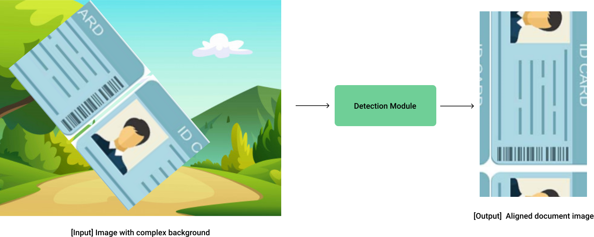
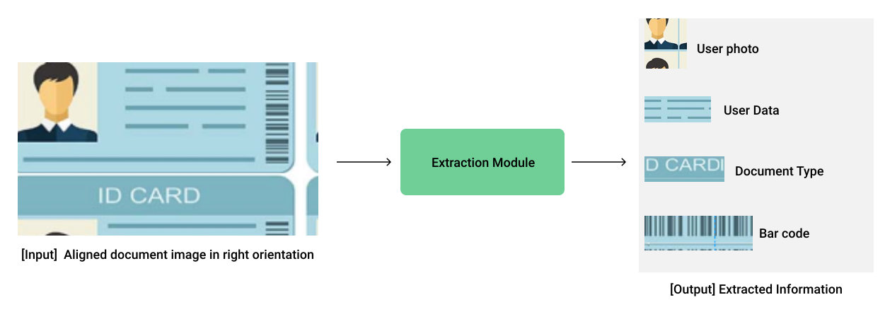

## **Introduction**
Welcome to this tutorial entitled **' Pytorch For Information Extraction '**. As the title implies, this tutorial demonstrates how possible it is to automate information retrieval on document images using **Machine Learning** with [**Pytorch**](https://pytorch.org). This tutorial primarily focuses on ways to leverage Pytorch and its features to address the complex task of Information Extraction on structured document images. To better understand this tutorial it is all about, it is important to clarify definitions and meanings concerning a few things.

Firstly, what is **Information Extraction**? According to Wikipedia, "Information Extraction is the task of automatically extracting structured information from unstructured and/or semi-structured machine-readable documents and other electronically represented sources".

Secondly, what are **structured document images**? This tutorial defines a structured document image as a digital image of a document like IDs, bills,  cheques, passport, driving license, etc on which every information (such as name, age, sex, expiry date, etc)  inscribed has a predefined position or field on the document.

Therefore,  this tutorial is a walkthrough leveraging Pytorch with the most convenient features to perform information extraction on document images. In other words, at the end of the tutorial, we shall build a system that takes an image of a structured document (like a student id card) and extracts inscribed information (such as student’s name,  department, date of birth, etc) as outputs.

## **Target Audience**
* AI practitioners and enthusiasts with interest in either Computer Vision, Machine Learning, or Pytorch.
* Researchers and academicians exploring various paths and possibilities for developing information extraction systems.
* Developers exploring ways to leverage machine learning to develop information extraction systems.
* Developers willing to learn key or primordial features of Pytorch looking forward to implementing the later in developing solutions aimed at solving real-world problems.
* Finally anyone interested and willing to learn Pytorch. Particularly for building computer vision systems like the project this tutorial is built on top of.

This tutorial assumes the reader's friendliness with Python and maybe a small machine learning background. Prior knowledge of Pytorch is not an absolute prerequisite, though having some basic knowledge of the machine learning library will help the reader to rapidly catch-on to the Pytorch related content and move along faster. So, for our Pytorch beginners' audience, there is no need to worry about not being able to follow the tutorial since the project being used as a foundation for the Pytorch educative materials is built from scratch. So just be patient, take your time, and do not rush.

## **Project Description**
The project which serves as the foundation for this tutorial aims at developing a pipeline that will take as input an image containing student-id(s) from the [Student-ID](https://github.com/MbassiJaphet/pytorch-for-information-extraction/tree/master/code/datasets/detection) testing dataset and extract information of interest from student-id in that image. Below is a sample student-id:

### Project Challenges
The main challenges of this project are well-known challenges from the long history of Information Extraction by Computer Vision systems. Thankfully, due to innovations brought by deep learning, most of those challenges can now be overcome and considered as part of a distant past. These challenges include but are not limited to:
* Localization of documents (student-ids) in images.
* Negation of complex backgrounds rendering the detection of documents difficult.
* Tolerance to possible to documents' orientations.
* Definition of rules for extracting desired information in their correct forms.

### Project Modules/Layout
As an attempt to overcome the various challenges listed above, the project itself is subdivided into three modules within which Pytorch and Machine Learning play important roles:

1.   A [**Detection Module,**](/detection-module/) responsible for locating documents of interest in images and performing image alignment on them.

2.   An [**Orientation Module,**](/orientation-module/) next to the detection module inspects the orientation of documents and rectifies it when necessary by applying the proper transformation on images.

3.   An [**Extraction Module,**](/extraction-module/) last in the chain extracts information in fields of interest from document images.

This tutorial teaches the basics for training, testing, and validating object detection, segmentation, and classification models using Pytorch. This tutorial is more like a mini-course on leveraging Pytorch and its features for Information Extraction, than being a simple straight forward tutorial. So, feel free to pause and take a break anytime at the end of each section/module, as even the structure of the notebook allows you to resume your work from where you left.

## **Project Dependencies**
Looking forward to experimenting with this tutorial in your local **Python*** environment, you may have to resolve the following dependencies:
*   pytorch
*   opencv-python
*   cython
*   pycocotools

:::important

For Windows users, get ``pycocotools`` from [philferriere](https://github.com/philferriere/cocoapi) by typing the command:

``pip install "git+https://github.com/philferriere/cocoapi.git#egg=pycocotools&subdirectory=PythonAPI"``

:::

>**Note** that [datasets](https://github.com/MbassiJaphet/pytorch-for-information-extraction/tree/master/code/datasets), [project](https://github.com/MbassiJaphet/pytorch-for-information-extraction/tree/master/code) source code, as well as this [tutorial](https://github.com/MbassiJaphet/pytorch-for-information-extraction) source code are publicly available on Github.